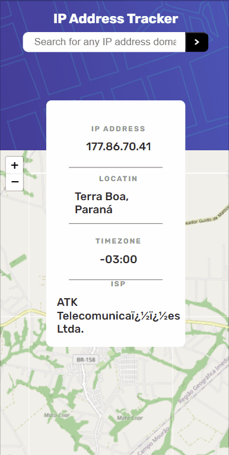

# Tracker

## Testado com Responsive Viewer

### Visualização em desktop

### Visualização em mobile

(Pressione CTRL + clique em qualquer gif para ser abrir o projeto em uma nova guia.)

## Descrição/Créditos do projeto

Projeto inspirado em um desafio do site FrontEnd Mentor, utilizando a API de geolozalização IPify e a API de mapeamento LeafletJS. Ao acessar o projeto, são buscados os dados da API IPify com base no IP do usuário e são retornados as informações do IP, cidade/estado, fuso horário e isp, além das coordenadas que são passadas para a API LeafletJS e é mostrado a localização do usuário. Há também um input no centro superior da tela, onde o usuário pode pesquisar por outros lugares passando o IP do local específico.

## Linguagens utilizadas

- HTML5
- CSS3
- JavaScript